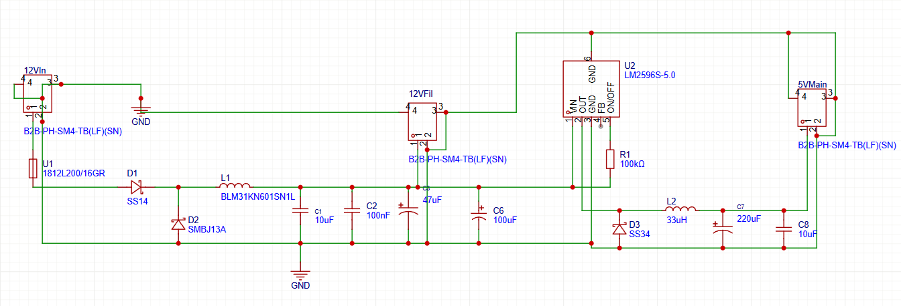
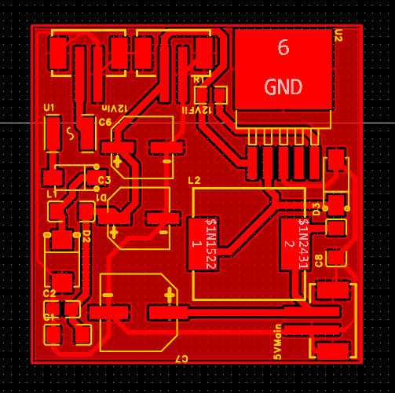
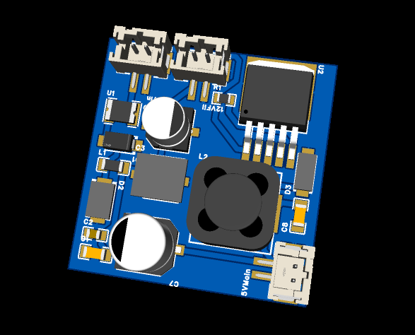

# LM2596 Buck Converter

DC-DC buck converter designed to step down 12V to 5V using the LM2596 switching regulator.

## Overview

This project is a simple DC-DC buck converter designed to convert 12V input voltage to a stable 5V output.  
The circuit includes input filtering, reverse polarity protection and output filtering to ensure stable operation.

## Features

- LM2596 switching regulator
- Input voltage: 12V
- Output voltage: 5V
- LC output filtering
- Reverse polarity protection
- PCB designed in Eagle CAD

## Schematic

## PCB Layout

## 3D View

## Files

- `schematic.png` – circuit schematic
- `pcb.png` – PCB layout
- `pcb-3d.png` – 3D board view
